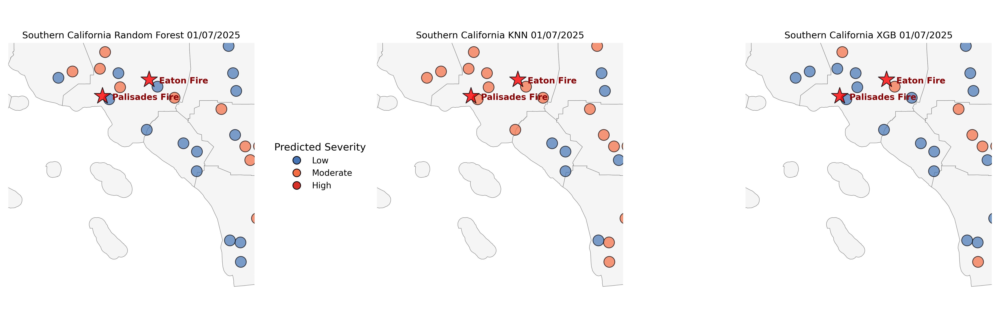
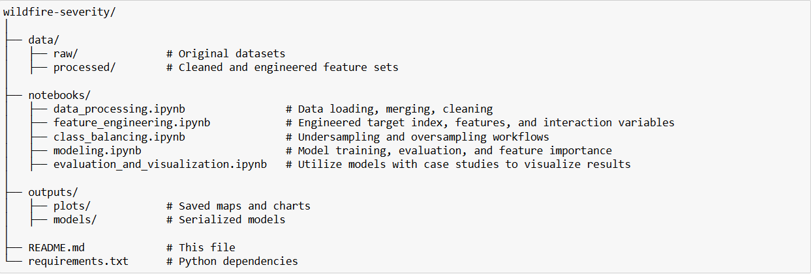
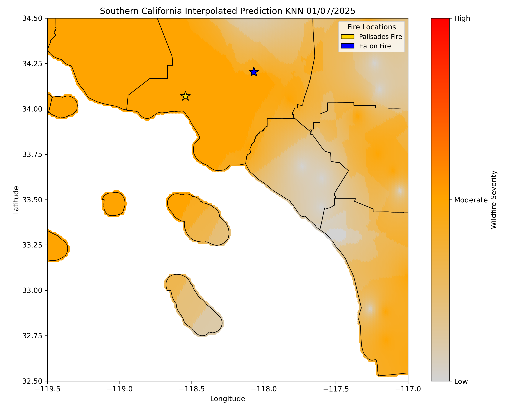
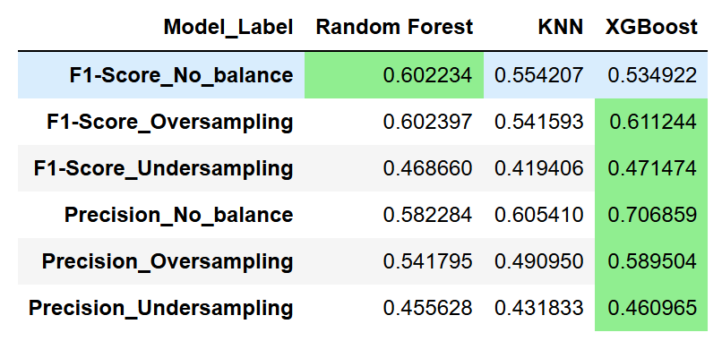

# Predicting Wildfire Potential Destructive Power in California

Author: Dustin Littlefield\
Project Type: Data Science & GIS Portfolio\
Technologies: Python, Pandas, Scikit-learn, XGBoost, GeoPandas, Matplotlib\
Skills: `Data cleaning` `feature engineering` `supervised machine learning` `model evaluation` `class imbalance handling` \
`spatial visualization` `exploratory data analysis` `reproducible workflow design` `results communication`\
Status: In Progress\
Last Updated: July 2025

## Overview
This project is a work in progress that explores the relationship between environmental and weather-related factors and wildfire severity in California. The goal is to predict a custom severity index `Wildfire Potential Destructive Power` — which incorporates structures damaged, structures destroyed, and fatalities.

**Disclaimer:** I am not a climate scientist or wildfire expert. This project is intended to demonstrate data science, geospatial, and machine learning skills. It is not designed for operational use or policy decisions.

Example output:\
\

---
## Objectives
- Predict wildfire severity based on environmental and weather data.
- Test classification models using resampling techniques to handle class imbalance.
- Create geospatial visualizations to illustrate regional risk patterns.
- Explore second-degree feature interactions and correlation to improve model features.
  
---

## Project Structure

---
## Data Sources

**Fire Incident Data** – includes structure and fatality impact measures. \
**California CIMIS Weather Data** – daily temperature, wind speed, precipitation, humidity. \
**California Demographic Data** - population density and mean income by county, proxy for firefighting resources \
**GIS Layers** – Shapefiles for spatial visualization.

---
## Data Processing
*Located in: notebooks/data_processing.ipynb*
- Merged fire records with weather station summaries by location and time.
- Created rolling averages for environmental variables.
- Engineered interaction features (e.g., Dryness, ETo_x_Vapor_Pressure).
- Imputed missing values for stations and derived features.
#### Key Features Used:
**Environmental / Weather Variables**
- `Avg Air Temp (F) 7 Day Avg` – Average air temperature over the past 7 days (°F); represents heat conditions.
- `Avg Vap Pres (mBars)` – Average vapor pressure; indicates atmospheric moisture.
- `Avg Rel Hum (%) 7 Day Avg` – Average relative humidity over 7 days; affects fire ignition and spread.
- `Avg Wind Speed (mph) 7 Day Avg` – Average wind speed; higher speeds can drive fire spread.
- `Precip (in) 7 Day Avg` – Total precipitation in the past 7 days; influences fuel moisture.
- `ETo (in)` – Reference evapotranspiration; approximates water loss from soil and plants.
\
**Derived / Interaction Features**
- `ETo_x_Vapor_Pressure` – Interaction between evapotranspiration and vapor pressure; models combined dryness effects.
- `ETo_x_Temp` – Interaction between evapotranspiration and air temperature; highlights hot, dry conditions.
- `Vapor_Pressure_x_Temp` – Interaction capturing the combined effect of heat and moisture.
- `Vapor_Pressure_x_Wind_Speed` – Interaction between wind and atmospheric moisture; affects drying conditions.
\
**Composite Index**
- `Dryness` – Custom dryness proxy combining weather variables; designed to approximate vegetation or fuel dryness.

---
## Class Balancing
*Located in: notebooks/class_balancing.ipynb*

**Target:** `WPDP` Wildlife Potential Destructive Power - categorized into Low, Moderate, High

**Issues:** Moderate and High Damage wildfire events classes are underrepresented.

Balancing Techniques Used:
- In method class balancing
- Manual undersampling of the dominant "Low" class.
- SMOTE for oversampling

Comparison of model performance across balancing strategies.

---
## Modeling
*Located in: notebooks/modeling.ipynb*

**Models tested:**
`Random Forest`
`K-Nearest Neighbors`
`XGBoost`

**Metrics evaluated:**
`F1-score (macro-averaged)`
`Confusion matrices`
`Cross-validation`

Feature importance extracted for tree-based models.

---
## GIS & Visualization
*Located in: notebooks/evaluation_and_visualization.ipynb*

- Maps using GeoPandas, Matplotlib, and Seaborn.
- IDW interpolation for environmental variables.
- Severity overlay by county or fire footprint.

Example Output:\
\

---
## Key Results

**Key Findings:** \
Models struggled with distinguishing Moderate and High severity classes.\
KNN achieved the highest F1-score overall.\
Class balancing significantly improved recall for minority classes. \
\

---
## Challenges

**Missing Environmental Data** – Gaps in weather stations required imputation.\
**Weak Correlation** – Environmental features don’t fully explain severity outcomes.\
**Class Imbalance** – Severe fires are rare; balancing was essential.\
**Derived Variable Uncertainty** – Proxies like Dryness need validation.\
**Spatial Generalization** – Models may not perform well across regions.

---
## Next Steps / Potential Improvements
- Add land cover, topography, and WUI datasets.
- Integrate population density and elevation.
- Incorporate days since ignition as a time-based feature.
- Try temporal or ensemble models.
- Consult domain experts to validate assumptions and feature selection.

---
## Installation
To run the project locally:\
git clone https://github.com/dustinlit/California_fire_severity.git \
cd wildfire-severity\
pip install -r requirements.txt

---
## License
This project is released under the MIT License. \
See LICENSE for details.

